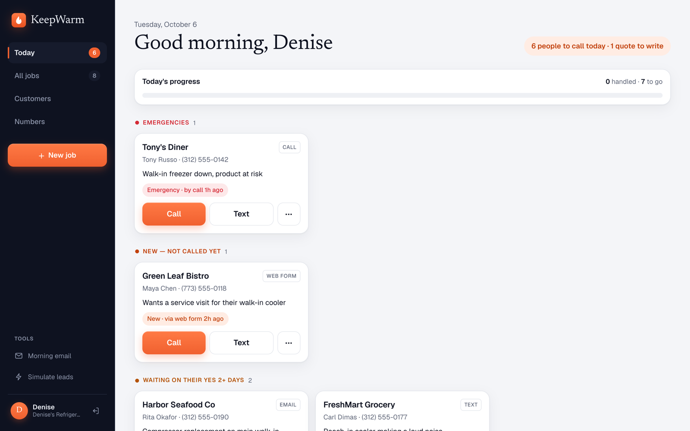
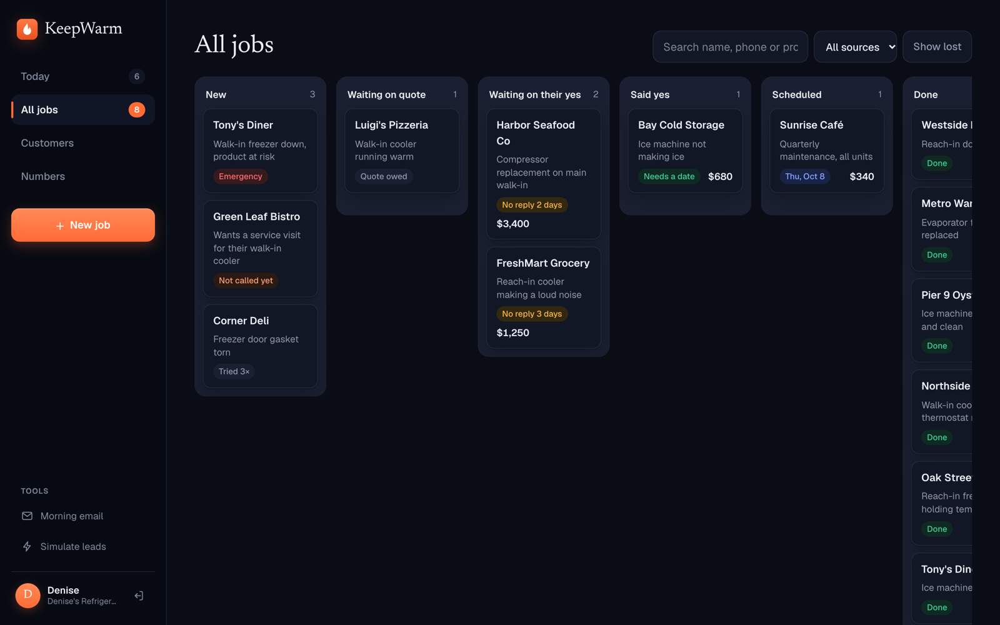
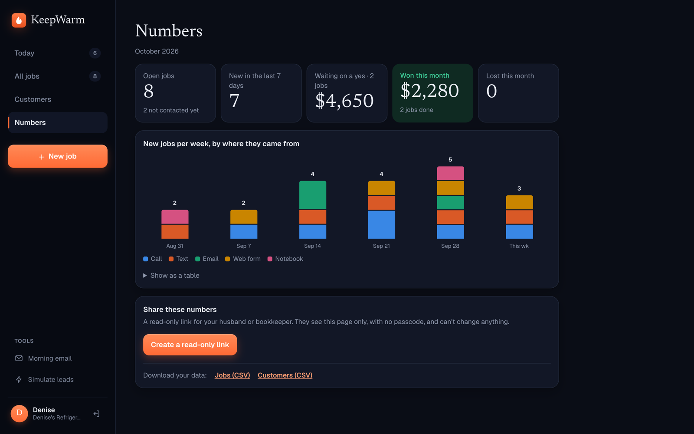
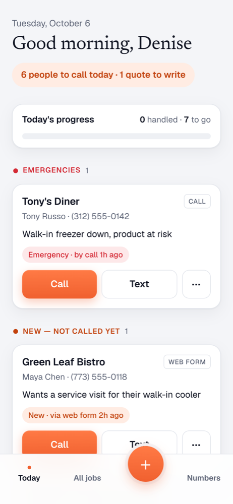

# KeepWarm

**Keep every lead warm.** A lead and follow-up tracker for small field-service businesses, starting with commercial refrigeration repair.

Job requests arrive by phone, text, email, website form and a paper notebook. KeepWarm puts them all in one list, tracks where each job stands, and shows the owner one thing each morning: **who to call today**. A job stays on that list until it is done or lost, so no request goes cold because it was forgotten.

**Live demo:** [keepwarm.vercel.app](https://keepwarm.vercel.app) (the passcode is filled in on the sign-in page). Use **Simulate leads** in the sidebar to send in a web form, email, customer text or missed call and watch it show up on Today.



| All jobs (dark mode) | Numbers (dark mode) | On a phone |
|---|---|---|
|  |  |  |

### Try it in 2 minutes

1. **Today.** Tony's Diner (freezer down) is at the top. Every card says why it is on the list.
2. **A reply to a quote.** Open **Simulate leads** and press *Simulate customer text*. FreshMart accepts their $1,250 quote; the message is added to their existing job (no duplicate) and it moves up on Today as "They messaged just now".
3. **New leads and spam.** Press *Simulate email* twice. The hotel's request becomes a new job; the SEO pitch is filtered out.
4. **Logging a call.** On Green Leaf Bistro, tap **···** → *Log contact* → *Left voicemail*. The card leaves today's list and comes back tomorrow morning.
5. **Quick add.** Tap **+ New job**, paste `Tony from Tony's Diner, ice machine is leaking again. 312-555-0142` and press *Organize it*. The fields are filled in and Tony is recognised as a repeat customer.
6. **Ready-to-send text.** Open FreshMart Grocery. The text under the Call and Text buttons is the follow-up on their $1,250 quote, already written.
7. **Snooze.** On Luigi's Pizzeria, tap **···** → *Remind me later* → *Monday*. It moves to the Snoozed list at the bottom of Today.
8. **Customer profile.** Tap *Tony's Diner* on any of its jobs: four jobs, $1,110 earned, and a pinned note with the door code.
9. **Numbers and sharing.** Open jobs, money waiting on a yes, and where leads come from. Press *Create a read-only link* and open it in a private window: the numbers, without the passcode or any way to change anything.

*Reset demo data* on the Simulate leads page restores the starting state.

For the reasoning behind the product (the problem, key decisions, assumptions, rollout and success measures), see the **[design notes](docs/DECISIONS.md)**.

---

## Features

- **Today.** One ranked list of who to call. Every card says why it is there ("No reply in 3 days", "Emergency · by call 40 min ago") and has one-tap **Call** and **Text** buttons that open the phone's own apps.
- **Today's progress.** A progress bar on Today ("3 handled · 6 to go") fills as calls, texts and quotes are logged, so clearing the list each morning feels finished.
- **Follow-up rules.** Any open job with no contact for 2 days comes back on its own. Quotes with no answer after 2 days are sorted by dollar amount. After 3 unanswered attempts the card suggests **Mark as lost?**, but nothing is ever closed automatically.
- **Snooze.** "Call me next week" leads can be set aside until tomorrow, Monday, a week out or any date. They leave Today, sit in a Snoozed list, and come back at 9am on the day, or immediately if the customer gets in touch first.
- **Simple stages.** New → Waiting on quote → Waiting on their yes → Said yes → Scheduled → Done (or Lost). One tap to move a job, with a full activity history.
- **Ready-to-send texts.** The Text button opens the phone's Messages app with a message written for where the job stands: a reply to a new request, a nudge on an unanswered quote, a visit confirmation. It is sent from the owner's own number, and "Texted" is logged with one tap afterwards.
- **Two-tap contact logging.** Talked to them, left a voicemail, texted, emailed, sent a quote, they said yes. After a call, the "How did it go?" sheet is already open.
- **One intake pipeline.** Website form, email, SMS and missed-call webhooks all go through the same `intake()` function. Spam and invoices are filtered out, and a message from a customer who already has an open job is added to that job instead of creating a duplicate.
- **Quick add.** Paste a text or email, or dictate with the keyboard mic. The message is turned into structured fields, shown for review, and saved. Repeat customers are recognised by phone number.
- **Emergency alerts and a morning email.** "Freezer down" requests send an alert immediately. A daily email repeats the Today list.
- **Numbers.** Open jobs, new this week, dollars waiting on a yes, won and lost this month (with the reasons jobs were lost), and new leads per week by source.
- **Customer profiles.** Every customer's jobs, money earned, win rate and a pinned note ("alley door, code 4412") that shows on each of their jobs. The Customers list puts the biggest customers first.
- **Share and export.** A read-only Numbers link for a partner or bookkeeper (no passcode, revocable at any time), and CSV downloads of every job and customer.
- **Mobile-first.** Bottom tab bar and large tap targets on phones; sidebar and column board on desktop; light and dark mode.

## How Today is ranked

`getTodayList(jobs, now, config)` in `lib/today.ts` is a pure function: no database, no AI, no hidden clock. Only open jobs are considered, and each job appears once, in the first group it matches:

| # | Group | Rule |
|---|---|---|
| 1 | Emergencies | Urgency is emergency and stage is New or Waiting on quote |
| 2 | New, not called yet | Stage is New with no contact attempts |
| 3 | Follow-ups due | Follow-up date is today or earlier, or the customer just messaged |
| 4 | Waiting on their yes | Quote sent 2+ days ago, largest amount first |
| 5 | Said yes, needs scheduling | Stage is Said yes |
| 6 | Quotes you owe | Stage is Waiting on quote |
| 7 | Gone quiet | No contact for 2+ days, unless a future follow-up or visit is set |

Snoozed jobs are left out of every group until their date, then return under Follow-ups due ("Reminder you set for today").

Thresholds live in one place (`lib/config.ts`). "Today" is calculated in the business's timezone (`BUSINESS_TZ`), not the server's.

## Architecture

```
 Web form    ── POST /api/inbound/webform ─┐
 Email       ── POST /api/inbound/email ───┤    intake(raw, source):
 SMS         ── POST /api/inbound/sms ─────┼──▶   1 extract fields (Claude, or rules as fallback)
 Missed call ── POST /api/inbound/call ────┤      2 not a job request? → log it, stop
 Quick add   ── /api/extract → review → save ┘    3 normalize phone (E.164)
                                                  4 match customer by phone, then email
                                                  5 open job? → add to it · else → new job
                                                  6 emergency? → send alert
                                     │
                     Postgres: customers · jobs · activities · inbound_log
                                     │
      Today list (pure, tested)   ·   Daily cron → morning email   ·   Numbers
```

- The SMS and call routes accept Twilio's form-encoded payloads as well as JSON. The email route takes `{ from, subject, text }`, which works with any inbound-email service or a Zapier/Make forward.
- The email, SMS and call routes require `?token=INBOUND_TOKEN`. The public web form uses a honeypot field instead.

### Where AI is used

AI is used for one thing: **turning a messy message into fields** (`lib/extract.ts`). With `ANTHROPIC_API_KEY` set, Claude Haiku 4.5 returns name, business, phone, email, address, a short problem summary, equipment, urgency, and whether the message is a job request at all. It uses structured outputs at temperature 0, and the result is validated with zod.

Without a key, or if the call fails, times out or returns invalid data, a rule-based extractor (`lib/extract-rules.ts`) takes over, so a lead is never dropped because a model call failed. **The live demo runs on the rule-based extractor.**

Ranking, deduplication, phone normalization, stage rules and reporting are plain code: fast, free, predictable and covered by tests.

## Tech stack

Next.js 16 (App Router, Server Components, Server Actions) · TypeScript · Tailwind CSS 4 · Drizzle ORM · Neon Postgres (PGlite locally) · Anthropic SDK · zod · Resend · Vitest · Vercel (hosting and cron)

## Getting started

Requires Node 22+.

```bash
npm install
npm run dev            # http://localhost:3000
```

No accounts or keys are needed. Locally the app uses an embedded Postgres (PGlite) stored in `./.pglite`, and demo data is loaded on first run.

| Command | Description |
|---|---|
| `npm run dev` | Start the development server |
| `npm test` | Unit and integration tests (in-memory Postgres) |
| `npm run lint` | ESLint |
| `npm run seed` | Reset to demo data (stop `npm run dev` first when using PGlite) |
| `npm run db:generate` | Generate a migration after changing `db/schema.ts` |
| `npm run db:migrate` | Apply migrations to `DATABASE_URL` (also runs on `npm run build`) |

### Environment variables

All optional; see [`.env.example`](.env.example).

| Variable | Effect |
|---|---|
| `DATABASE_URL` | Use Postgres (e.g. Neon) instead of PGlite |
| `ANTHROPIC_API_KEY`, `ANTHROPIC_MODEL` | Claude extraction (default `claude-haiku-4-5`) instead of rules |
| `RESEND_API_KEY`, `ALERT_EMAIL_TO`, `ALERT_EMAIL_FROM`, `APP_URL` | Send emergency alerts and the morning email (otherwise logged to the console) |
| `APP_PASSCODE` | Require a shared passcode (httpOnly cookie, 90 days) |
| `SHOW_PASSCODE` | `true` pre-fills the passcode on the sign-in page (public demos only) |
| `INBOUND_TOKEN` | Required `?token=` on the email, SMS and call webhooks |
| `CRON_SECRET` | Protects `/api/cron/digest` (sent automatically by Vercel Cron) |
| `BUSINESS_TZ`, `OWNER_NAME`, `BUSINESS_NAME` | Localize to the business |

### Deploying to Vercel

1. Import the repository in Vercel and add a Neon database from the Storage tab (it sets `DATABASE_URL`).
2. Set `APP_PASSCODE`, `INBOUND_TOKEN` and `CRON_SECRET`, plus the Anthropic and Resend variables if wanted.
3. Deploy. The build applies migrations. Load demo data once with `DATABASE_URL=… npm run seed`.
4. The cron in `vercel.json` sends the morning email daily at 12:00 UTC.

### Tests

| File | Covers |
|---|---|
| `lib/today.test.ts` | Every Today group, ordering, one group per job, follow-up and visit suppression, snoozing, "Mark as lost?", thresholds, timezone end-of-day |
| `lib/jobs.test.ts` | Contact logging, stage changes and snoozing against a real (in-memory) Postgres |
| `lib/intake.test.ts` | New leads, repeat-customer messages, emergencies, spam, missed calls |
| `lib/extract.test.ts` | Extraction from a messy SMS, a forwarded form email, a notebook note and spam (also against Claude when a key is set) |
| `lib/messages.test.ts` | Ready-to-send texts for each stage |
| `lib/customers.test.ts` | Customer roll-ups (earned, win rate, latest job) and ranking |
| `lib/share.test.ts`, `lib/csv.test.ts` | Share links (create, replace, revoke) and safe CSV output |
| `lib/phone.test.ts`, `lib/numbers.test.ts` | Phone normalization and reporting |

### Project layout

```
app/(app)/          Today, All jobs, Job detail, Add job, Customers, Numbers, Simulate leads, Morning email (signed in)
app/share/[token]   Read-only Numbers link
app/contact         Public sample contact form
app/api/inbound/*   Intake webhooks
app/api/extract     Text → fields for quick add
app/api/export      CSV downloads
app/api/cron/digest Daily morning email
app/actions.ts      Server actions (thin wrappers around lib/)
lib/today.ts        Today ranking
lib/intake.ts       Intake pipeline
lib/extract*.ts     Claude extraction and rule-based fallback
lib/jobs.ts         Job state changes
db/schema.ts        Database schema
```

## Scope

Deliberately not included in this version:

| Not included | Reason |
|---|---|
| Technician scheduling and dispatch | The owner already knows where her techs are; the problem is leads, not routing |
| Invoicing, payments, inventory | Handled by existing bookkeeping |
| User accounts and roles | Two people use it; a shared passcode is enough |
| Texting customers from the app | Customers should keep seeing the owner's own number, and US carrier rules (A2P 10DLC) add cost and delay. Call and Text open the phone's own apps |
| AI-decided priority | The owner should always be able to see why someone is on the list |
| Native app, real-time sync | A web app saved to the home screen covers one or two users |

## Roadmap

- A Twilio number that forwards to the owner's cell, so missed calls, voicemails and texts become leads automatically (the webhooks are ready).
- A weekly summary email for a partner or bookkeeper.
